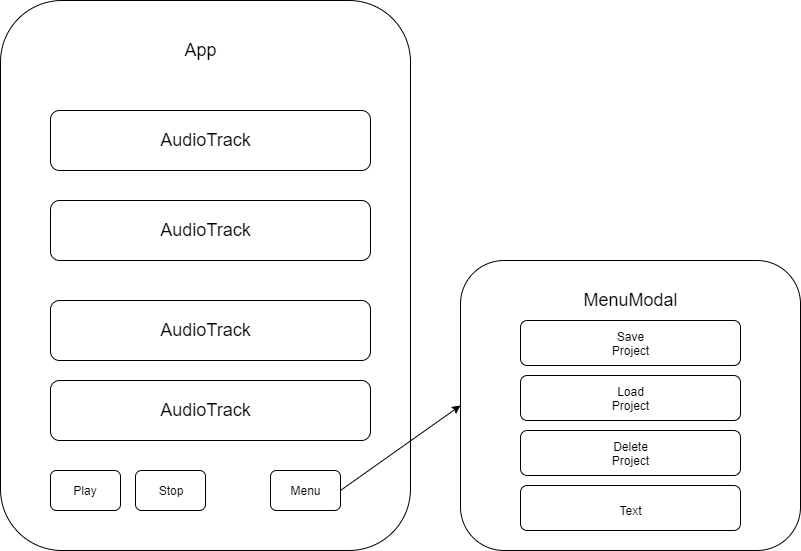
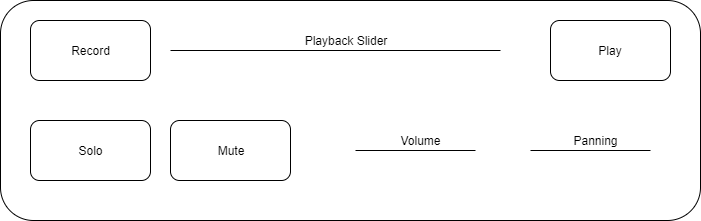
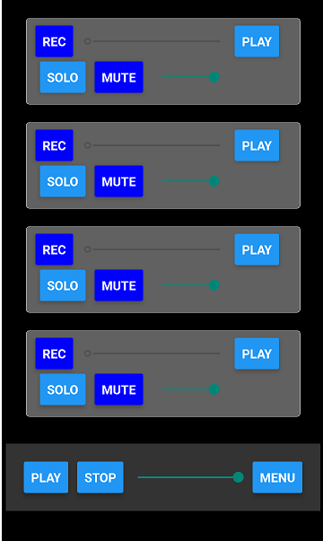

# Multi-track Recorder

#### _A multi-track recorder react-native application targetting Android_

#### By _**Jason Huels** December 12, 2019_

## Description
_An Android multi-track recorder application, designed to allow users to quickly prototype songs._

## MVP
* Ability to record 4 audio tracks from device microphone
* Each track can be played back individually or simultaneously
* Each track should have individual volume control
* Project can be saved/loaded/deleted on local storage

## Stretch Goals
* Record button count-in
* Record button punch-in
* Panning controls for each track
* Solo/Mute buttons for each track
* Each track can be exported in uncompressed format (wav/aac)
* Audio tracks can be recorded from direct input (will require a preamp)
* Metronome with adjustable BPM
* Tuner 

# TODO List
## MVP
### AudioTrack Component
- [x] Record from mic
- [x] Playback individual track recording
- [x] Track record triggers other tracks to play (unless muted)
- [x] Adjust track volume with slider
- [x] Mute Button
- [x] Solo Button
- [x] Dynamically toggle solo/mute during playback
- [ ] Adjust playback slider to match track position

### App Component
- [x] Render AudioTracks
- [x] Play button triggers all tracks to play
- [x] Stop button triggers all tracks to stop

### Menu Component
- [x] Create menu as a modal
- [ ] Save project to local storage
- [ ] Load saved project from storage
- [ ] Delete saved project from storage

## Stretch
### AudioTrack Component
- [ ] Count-in on record press
- [ ] Allow record button to punch-in instead of overwritting from beginning of track
- [ ] Delete unwanted tracks rather than recording over them or muting them
- [ ] Panning controls
- [ ] Direct input recording

### App Component

### Menu Component
- [ ] Export as uncompressed file
- [ ] Metronome with adjustable BPM
- [ ] Tuner

## Components
#### App

#### AudioTrack

## Setup/Installation Requirements_
_Requirements: Node.js, Expo SDK 33 or higher, Android device or simulator_
* _Clone this repository_
* _Navigate to the directory_
* _Run "npm install" command to install necessary packages_
* _Run "expo start" to start the server_
* _Use the expo app on your Android device to scan the QR code and launch the application_

## Known Bugs
* Does not function on iPhone
* Latency in playback of tracks
* Saving seems to work but can't be found on device

## Support and contact details
_jasonhuels@yahoo.com_

## Technologies Used
_JavaScript, React-Native, Expo, Expo-AV Node.js_

### License
Open-source